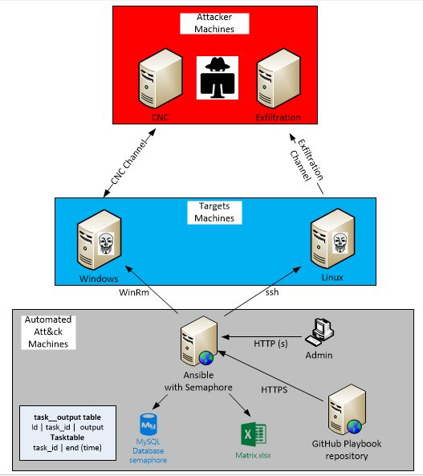
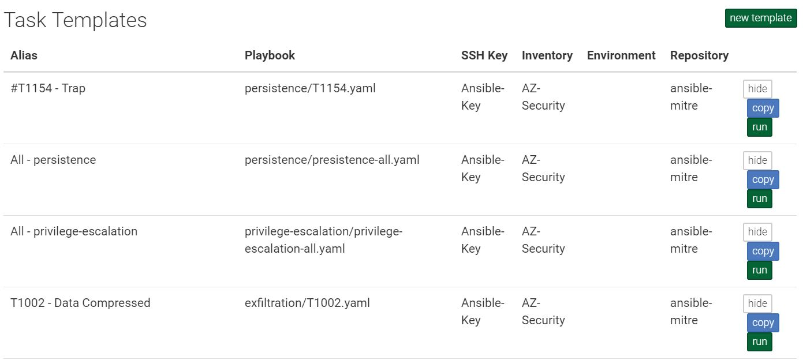

# ansible-mitre
Attack playbooks based on MITRE ATT&CK framework using ansible format

## Prerequisites
- ansible (`apt-get install ansible`)
- ansible-winrm (`pip install "pywinrm>=0.3.0"`)
- customize vars.yaml file

## Architecture
 - Ansible Playbook machine with Semaphore GUI and mySQL database
 - Victim machines, here windows and linux (Can be over the same LAN or accross the WAN, traffic is encrypted)
 - Attacking machine, can be the same machine or can be split.
 
 Attacking machine fqdn or IP are configured in the vars.yaml file

## Installation
- `git clone https://github.com/rallyspeed/ansible-mitre.git`

## Usage - CLI
- `ansible-playbook [playbook].yaml`
 Some playbooks require tags
 
## Usage - GUI
- Create som task templates based on playbook repository

- Launch the task

## Optional INSTALL SEPHAMORE GUI
INSTALL  sephamore for GUI interface.
 - `apt-get install mysql-server`
 - `mysql_secure_installation`
 - `wget https://github.com/ansible-semaphore/semaphore/releases/download/v2.5.1/semaphore_2.5.1_linux_amd64.deb`
 - `dpkg -i semaphore_2.5.1_linux_amd64.deb`
 - `semaphore -setup`
## Optional RUN SEPHAMORE GUI
 - `ssh-agent bash`
 - `ssh-add ~/.ssh/id_rsa`
 - `ssh -T git@github.com` To confirm ansible machine can reach the github repo
 - `semaphore -config /opt/config.json &`
 
## Required install to generate report (report.py)
 - `python3 -m pip uninstall pip && sudo apt install python3-pip --reinstall`
 - `apt-get install libmysqlclient-dev`
 - `pip3 install mysqlclient`
 - `pip3 install openpyxl`

## Report Generation
 - `python3 report.py`

